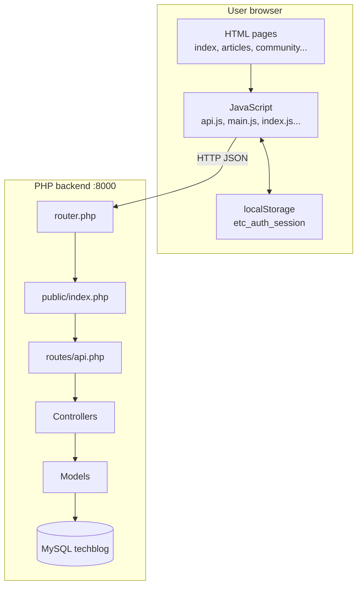
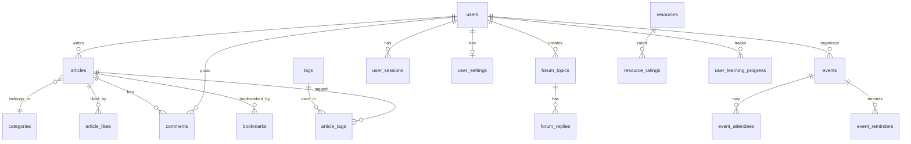
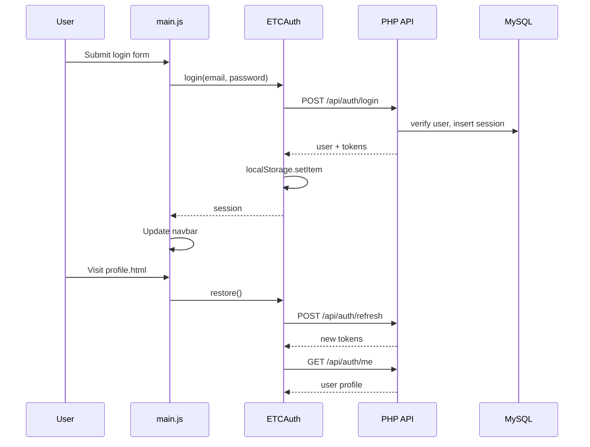

# Ethiopian Tech Community (ETC) — Backend & Frontend Integration Manual

**Project:** TechBlog / Blog-App  
**Version:** 1.0  
**Stack:** PHP 8.1+ · MySQL · Vanilla HTML/CSS/JavaScript  
**API base URL (development):** `http://localhost:8000`

---

## Document information

| Item | Detail |
|------|--------|
| Audience | Developers, reviewers, and maintainers of the ETC platform |
| Scope | Backend architecture, REST API, database, and how the static frontend connects |
| Estimated length | ~15 pages (printed) |
| Repository layout | `Blog-App/` (frontend) + `Blog-App/backend/` (API) |

---

## Table of contents

1. [Introduction](#1-introduction)
2. [High-level architecture](#2-high-level-architecture)
3. [Backend project structure](#3-backend-project-structure)
4. [Request lifecycle](#4-request-lifecycle)
5. [Configuration and environment](#5-configuration-and-environment)
6. [Database design](#6-database-design)
7. [Authentication and authorization](#7-authentication-and-authorization)
8. [API modules (business logic)](#8-api-modules-business-logic)
9. [Complete API reference](#9-complete-api-reference)
10. [Response format and errors](#10-response-format-and-errors)
11. [Frontend architecture](#11-frontend-architecture)
12. [Frontend–backend integration](#12-frontendbackend-integration)
13. [Page-by-page integration map](#13-page-by-page-integration-map)
14. [Installation and operations](#14-installation-and-operations)
15. [Development, testing, and troubleshooting](#15-development-testing-and-troubleshooting)
16. [Appendix](#16-appendix)

---

## 1. Introduction

### 1.1 Purpose of the system

The **Ethiopian Tech Community (ETC)** application is a community platform for Ethiopian developers. It provides:

- Blog-style **articles** and categories
- **Community** features (member directory, forum, mentorship)
- **Events** (meetups, hackathons, RSVP)
- **Resources** (downloads, learning paths, ratings)
- **User accounts** with profiles and settings
- Static pages: **About**, **Contact**, home **stats**

The **backend** is a custom PHP REST API backed by **MySQL**. The **frontend** is a multi-page static site (HTML + JavaScript) that talks to the API over HTTP using `fetch()`.

### 1.2 Design philosophy

The backend intentionally avoids heavy frameworks (no Laravel/Symfony). Instead it uses:

- A **single front controller** (`public/index.php`)
- A **route table** (`routes/api.php`)
- **Thin controllers** that validate input and call **models**
- **PDO** for database access
- **JWT** for stateless API auth plus **server-side sessions** for refresh/logout

This keeps the project easy to deploy on shared hosting or XAMPP-style environments common in student and local projects.

### 1.3 Team module ownership (historical)

Routes were originally split across team members (“Person 1–6”). The codebase now implements all modules:

| Person | Module | Controller |
|--------|--------|------------|
| 1 | Auth, newsletter, stats | `AuthController` |
| 2 | Articles, categories, tags | `ArticleController` |
| 3 | Comments, likes, bookmarks | `CommentController` |
| 4 | Community, forum, mentorship | `CommunityController` |
| 5 | Events, RSVP, reminders | `EventController` |
| 6 | Resources, contact, about | `ResourceController` |

---

## 2. High-level architecture

### 2.1 System diagram



### 2.2 Deployment topology (local development)

| Component | URL / path | Role |
|-----------|------------|------|
| PHP built-in server | `http://localhost:8000` | Serves API **and** can serve static files via router |
| MySQL | `127.0.0.1:3306` | Database `techblog` |
| Frontend HTML | `Blog-App/*.html` | Opened via Live Server, file://, or same host |

**Important:** `assets/js/api.js` assumes the API is on **port 8000**. If the frontend is opened from another port (e.g. Live Server on 5500), requests still go to `http://localhost:8000` unless you set `window.APP_CONFIG.apiBaseUrl`.

### 2.3 CORS

`public/index.php` sends:

```
Access-Control-Allow-Origin: *
Access-Control-Allow-Headers: Content-Type, Authorization
Access-Control-Allow-Methods: GET, POST, PUT, PATCH, DELETE, OPTIONS
```

`OPTIONS` requests return `204` with no body. This allows the static frontend on a different origin/port to call the API during development.

---

## 3. Backend project structure

```
Blog-App/backend/
├── .env                    # Environment variables (not committed with secrets in production)
├── composer.json           # PHP scripts: setup, serve, test
├── php.ini                 # Local PHP config (extension_dir, timezone)
├── router.php              # Dev server entry: static files + API
├── setup.cmd / serve.cmd   # Windows helpers
├── config/
│   ├── database.php        # PDO settings from env
│   ├── jwt.php             # JWT secret, issuer, TTL
│   ├── mail.php            # Mail from address
│   └── learning_paths.php  # Learning path definitions (slug, steps, category)
├── migrations/
│   └── database.sql        # Full schema + seed data
├── public/
│   └── index.php           # Front controller
├── routes/
│   └── api.php             # Route map (method + path → controller action)
├── scripts/
│   └── setup.php           # Creates DB, runs migration safely
├── src/
│   ├── Controllers/        # HTTP handlers
│   │   └── Concerns/
│   │       └── AuthenticatesRequests.php
│   ├── Models/             # Database queries
│   ├── Services/           # Mail, JWT, validation, cache
│   ├── Helpers/            # Response, Security, Str
│   └── Support/            # Database singleton, Request
├── storage/downloads/      # HTML files served as downloadable resources
└── tests/
    └── Test.php            # Smoke tests (no DB required)
```

### 3.1 Layer responsibilities

| Layer | Responsibility | Example |
|-------|----------------|---------|
| **Router** (`router.php`) | Serve real files under `/public` or `/storage`; else delegate to API | `GET /storage/downloads/foo.html` |
| **Front controller** | Autoload, match route, invoke controller, JSON output | `findRoute()` in `index.php` |
| **Controller** | HTTP semantics, auth checks, validation | `ArticleController::store()` |
| **Model** | SQL, formatting records | `Article::paginate()` |
| **Service** | Cross-cutting utilities | `TokenService::decode()` |
| **Helper** | Pure functions / response builders | `Response::success()` |

---

## 4. Request lifecycle

### 4.1 Step-by-step flow

1. Developer runs: `php -c php.ini -S localhost:8000 router.php` (via `serve.cmd`).
2. Browser requests e.g. `GET http://localhost:8000/api/articles`.
3. `router.php` checks if the path is a physical file in `public/` or `storage/`; if not, loads `public/index.php`.
4. `index.php` registers a PSR-4-style autoloader for classes under `App\` → `src/`.
5. Route table is loaded from `routes/api.php`.
6. `findRoute()` matches method + path; captures `{id}`, `{slug}` parameters.
7. Controller is instantiated; action method is called: `$controller->$action($params, $_GET)`.
8. Action returns an **array** (not raw JSON); `index.php` extracts `status`, calls `Response::json()`.
9. Uncaught exceptions become `500` JSON with `message`.

### 4.2 Route matching rules

- Routes are defined as `'METHOD /path' => [ControllerClass::class, 'methodName']`.
- **Order matters:** static segments must appear **before** parameterized routes.
  - Correct: `GET /api/articles/search` before `GET /api/articles/{id}`.
  - Wrong: `{id}` would capture `search` as an id.
- Path parameters use regex `(?P<name>[^/]+)`.

### 4.3 Autoloading

Classes in namespace `App\` map to `src/`:

- `App\Controllers\ArticleController` → `src/Controllers/ArticleController.php`
- `App\Models\User` → `src/Models/User.php`

Controllers manually `require_once` `Response.php` for historical reasons; other classes autoload.

---

## 5. Configuration and environment

### 5.1 `.env` file

Loaded by `scripts/setup.php` and at runtime via `getenv()` in config files.

| Variable | Purpose | Example |
|----------|---------|---------|
| `APP_NAME` | Application name | `TechBlog` |
| `APP_ENV` | Environment | `local` |
| `APP_DEBUG` | Verbose errors (display in php.ini too) | `true` |
| `APP_URL` | Base URL for download links | `http://localhost` |
| `DB_HOST` | MySQL host | `127.0.0.1` |
| `DB_PORT` | MySQL port | `3306` |
| `DB_NAME` | Database name | `techblog` |
| `DB_USER` / `DB_PASS` | Credentials | `root` / empty |
| `JWT_SECRET` | HMAC key for JWT | long random string |
| `JWT_ISSUER` / `JWT_AUDIENCE` | Token validation | `techblog-api` / `techblog-client` |
| `JWT_TTL` | Access token lifetime (seconds) | `3600` |
| `MAIL_*` | Mail settings | Mailtrap, etc. |
| `CONTACT_NOTIFY_EMAIL` | Admin inbox for contact form | `admin@etc.com` |

### 5.2 `config/database.php`

Returns a PHP array consumed by `App\Support\Database::connection()`:

- Single **PDO** instance (singleton)
- `ERRMODE_EXCEPTION`, `FETCH_ASSOC`, `utf8mb4`

### 5.3 `php.ini` (project-local)

Used by `setup.cmd` and `serve.cmd`:

```ini
extension_dir="C:\php\ext"
extension=pdo_mysql
extension=mysqli
extension=openssl
extension=mbstring
date.timezone=Africa/Addis_Ababa
```

Adjust `extension_dir` if PHP is installed elsewhere.

### 5.4 Setup script behavior

`scripts/setup.php`:

1. Creates database if missing.
2. Parses `migrations/database.sql` statement-by-statement.
3. **Skips** destructive/diagnostic statements: `DROP DATABASE`, `CREATE DATABASE`, `USE`, `SHOW TABLES`, diagnostic `SELECT` counts.
4. Converts `CREATE TABLE` → `CREATE TABLE IF NOT EXISTS`.
5. Converts `INSERT` → `INSERT IGNORE` (re-runnable seeds).
6. Replaces placeholder admin hash `$2y$10$YourHashHere` with `password_hash('admin123')`.

---

## 6. Database design

### 6.1 Entity relationship overview



### 6.2 Core tables (23)

| Table | Purpose |
|-------|---------|
| `users` | Accounts (username, email, password_hash, profile fields) |
| `user_sessions` | Hashed session tokens, expiry, IP, user agent |
| `user_settings` | Notifications, theme, visibility |
| `newsletter_subscribers` | Email list |
| `categories` | Article categories |
| `articles` | Blog posts (slug, content, status, views) |
| `tags` / `article_tags` | Many-to-many tagging |
| `comments` | Nested comments on articles |
| `article_likes` / `bookmarks` | User interactions |
| `forum_topics` / `forum_replies` | Discussion board |
| `user_skills` | Skills on profiles |
| `mentorship_requests` | Mentor/mentee requests |
| `events` | Event metadata |
| `event_attendees` | RSVP status |
| `event_reminders` | Scheduled reminders |
| `resources` | Downloads and learning-path trackers |
| `resource_ratings` | 1–5 star ratings |
| `user_learning_progress` | Per-user path progress % |
| `site_pages` | JSON content for static pages (about) |
| `contact_messages` | Contact form submissions |

### 6.3 Seed data

After setup, the database includes:

- Admin user: `admin@etc.com` / `admin123`
- Sample users: lelisa, ruth, sami
- Categories: Web, Mobile, AI, DevOps
- Tags: php, javascript, python, react, flutter
- 3 published articles, 2 events, 2 forum topics
- 7 resources + about page JSON

---

## 7. Authentication and authorization

### 7.1 Dual-token model

| Token | Storage | Lifetime | Purpose |
|-------|---------|----------|---------|
| **Access token (JWT)** | Browser `localStorage` | `JWT_TTL` (default 1 hour) | Sent as `Authorization: Bearer ...` on protected routes |
| **Session token** | Browser `localStorage` + DB `user_sessions` | 30 days | Refresh session, logout |

### 7.2 JWT structure (`TokenService`)

- Algorithm: **HS256**
- Payload claims: `iss`, `aud`, `sub` (user id), `email`, `username`, `iat`, `exp`
- Validated on decode: signature, issuer, audience, expiry

### 7.3 Session storage

On login/register, `AuthController::issueTokens()`:

1. Generates random 32-byte hex `session_token`.
2. Stores **SHA-256 hash** in `user_sessions` (not plaintext).
3. Returns both tokens to the client.

Logout deletes the session row by hashed token.

### 7.4 Protected endpoints

Controllers use trait `AuthenticatesRequests`:

- `requireUser()` — Bearer JWT required; returns user row
- `optionalUser()` — JWT if present, else null
- `requireAdmin()` — user email must be `admin@etc.com`
- `isAdmin($user)` — same check for resource ownership rules

`AuthController` has its own `authenticatedUser()` (same logic).

### 7.5 Authorization rules (summary)

| Action | Rule |
|--------|------|
| Create article | Logged in; non-admin → forced `draft` |
| Edit/delete article | Author or admin |
| Edit/delete comment | Author or admin |
| Edit forum reply | Author or admin |
| Edit/delete event | Organizer or admin |
| Rate resource / save progress | Logged in |
| View contact messages | Admin only |

---

## 8. API modules (business logic)

### 8.1 Auth module (`AuthController` + `User` model)

**Endpoints:** register, login, logout, refresh, me, profile, settings, newsletter, stats, health.

**Register flow:**

1. Validate username, email, password (min 8 chars).
2. Check uniqueness.
3. `Security::hash()` password (bcrypt).
4. Insert user, issue tokens, send welcome email.

**Login flow:**

1. Find by email, `password_verify()`.
2. Check `is_active`.
3. Update `last_login`, issue tokens.

**Stats (`GET /api/stats`):** counts from DB (students, developers, articles, newsletter, mentors, forum topics, events).

### 8.2 Articles module (`ArticleController` + `Article` model)

- **List** with pagination, filters: category, tag, author, sort, reading time, full-text search (`MATCH...AGAINST`).
- **Show** by id or slug; increments `views`.
- **CRUD** with slug auto-generation (`Str::uniqueSlug()`).
- **Tags** synced via `article_tags` junction table.
- **Categories/tags** listing endpoints for filters.

Published articles only for public unless admin uses `?include_drafts=1`.

### 8.3 Comments module (`CommentController` + `Comment` model)

- Threaded comments (`parent_id`) returned as a tree.
- Like/unlike article (junction table `article_likes`).
- Bookmark/remove bookmark.
- Comment like increments `comments.likes` column.

### 8.4 Community module (`CommunityController` + `User` + `Forum`)

- **listUsers** — paginated public directory (`GET /api/users`).
- **searchUsers** — `?q=` search.
- **showUser** — profile + skills + article count.
- **Mentorship** — create request, list matches for current user.
- **Forum** — topics by category, replies, create topic/reply, mark solution on reply update.

### 8.5 Events module (`EventController` + `Event` model)

- List/filter by status, city, type, date range.
- **Calendar** endpoint returns lightweight events between `from` and `to`.
- CRUD for organizers; RSVP with status `interested|going|waitlist`.
- Attendees list; reminders stored in `event_reminders`.

### 8.6 Resources module (`ResourceController` + `Resource` model)

- List resources with filters (`type`, `category`, `featured`, `scope=downloads|library`).
- **Download** — increments counter, returns file URL under `storage/downloads/`.
- **Rate** — 1–5 stars, updates `average_rating`.
- **Learning paths** — merges `config/learning_paths.php` with DB progress per user.
- **Contact** — validates form, saves to DB, emails admin + confirmation.
- **About** — loads JSON from `site_pages` where `slug='about'`.

---

## 9. Complete API reference

All paths are prefixed with `http://localhost:8000` in development.

### 9.1 Auth & general

| Method | Path | Auth | Description |
|--------|------|------|-------------|
| GET | `/api/health` | No | Service health check |
| POST | `/api/auth/register` | No | Create account |
| POST | `/api/auth/login` | No | Login |
| POST | `/api/auth/logout` | No* | End session (*body: session_token) |
| POST | `/api/auth/refresh` | No* | Refresh tokens (*session_token) |
| GET | `/api/auth/me` | Bearer | Current user |
| PUT | `/api/auth/profile` | Bearer | Update profile |
| GET | `/api/auth/settings` | Bearer | Get settings |
| PUT | `/api/auth/settings` | Bearer | Update settings |
| POST | `/api/newsletter/subscribe` | No | Subscribe email |
| GET | `/api/stats` | No | Public statistics |

### 9.2 Articles

| Method | Path | Auth | Description |
|--------|------|------|-------------|
| GET | `/api/articles` | Optional | List (`page`, `per_page`, `category`, `tag`, `sort`) |
| GET | `/api/articles/search` | No | Search `?q=` |
| GET | `/api/articles/{id}` | Optional | Single article |
| GET | `/api/articles/slug/{slug}` | Optional | By slug |
| GET | `/api/categories` | No | All categories |
| GET | `/api/tags` | No | All tags |
| POST | `/api/articles` | Bearer | Create |
| PUT | `/api/articles/{id}` | Bearer | Update |
| DELETE | `/api/articles/{id}` | Bearer | Delete |

### 9.3 Comments & interactions

| Method | Path | Auth | Description |
|--------|------|------|-------------|
| GET | `/api/articles/{id}/comments` | No | List comments |
| POST | `/api/articles/{id}/comments` | Bearer | Add comment |
| PUT | `/api/comments/{id}` | Bearer | Edit comment |
| DELETE | `/api/comments/{id}` | Bearer | Delete comment |
| POST | `/api/articles/{id}/like` | Bearer | Like article |
| DELETE | `/api/articles/{id}/like` | Bearer | Unlike |
| POST | `/api/articles/{id}/bookmark` | Bearer | Bookmark |
| DELETE | `/api/articles/{id}/bookmark` | Bearer | Remove bookmark |
| POST | `/api/comments/{id}/like` | No | Increment comment likes |

### 9.4 Community

| Method | Path | Auth | Description |
|--------|------|------|-------------|
| GET | `/api/users` | No | List members |
| GET | `/api/users/search` | No | Search `?q=` |
| GET | `/api/users/{id}` | No | Public profile |
| POST | `/api/mentorship/request` | Bearer | Request mentor |
| GET | `/api/mentorship/matches` | Bearer | My mentorship rows |
| GET | `/api/forum/topics` | No | List topics |
| POST | `/api/forum/topics` | Bearer | Create topic |
| GET | `/api/forum/topics/{id}/replies` | No | Topic + replies |
| POST | `/api/forum/topics/{id}/replies` | Bearer | Post reply |
| PUT | `/api/forum/replies/{id}` | Bearer | Edit reply / mark solution |

### 9.5 Events

| Method | Path | Auth | Description |
|--------|------|------|-------------|
| GET | `/api/events` | Optional | List events |
| GET | `/api/events/calendar` | No | Calendar range `?from=&to=` |
| GET | `/api/events/{id}` | Optional | Event detail |
| POST | `/api/events` | Bearer | Create |
| PUT | `/api/events/{id}` | Bearer | Update |
| DELETE | `/api/events/{id}` | Bearer | Delete |
| POST | `/api/events/{id}/rsvp` | Bearer | RSVP |
| DELETE | `/api/events/{id}/rsvp` | Bearer | Cancel RSVP |
| GET | `/api/events/{id}/attendees` | No | Attendee list |
| POST | `/api/events/{id}/reminder` | Bearer | Set reminder |

### 9.6 Resources & contact

| Method | Path | Auth | Description |
|--------|------|------|-------------|
| GET | `/api/about` | No | About page JSON |
| GET | `/api/resources` | No | List resources |
| GET | `/api/resources/learning-paths` | Optional | Paths + progress |
| POST | `/api/resources/progress` | Bearer | Save learning progress |
| GET | `/api/resources/{id}/download` | No | Download metadata + URL |
| POST | `/api/resources/{id}/rate` | Bearer | Rate resource |
| POST | `/api/contact` | No | Submit contact form |
| GET | `/api/contact/messages` | Admin | List messages |

---

## 10. Response format and errors

### 10.1 Success envelope

```json
{
  "success": true,
  "message": "Articles loaded.",
  "data": {
    "articles": [],
    "pagination": { "page": 1, "per_page": 12, "total": 3, "total_pages": 1 }
  }
}
```

Controllers return a PHP array; `index.php` adds HTTP status from `$result['status']` (default 200) then unsets it before JSON encoding.

### 10.2 Error envelope

```json
{
  "success": false,
  "message": "Registration failed.",
  "errors": {
    "email": ["Email is already registered."]
  }
}
```

Common HTTP status codes: `401` unauthorized, `403` forbidden, `404` not found, `422` validation, `500` server error.

### 10.3 Example: login from curl

```bash
curl -X POST http://localhost:8000/api/auth/login ^
  -H "Content-Type: application/json" ^
  -d "{\"email\":\"admin@etc.com\",\"password\":\"admin123\"}"
```

Use `data.tokens.access_token` in subsequent requests:

```bash
curl http://localhost:8000/api/auth/me ^
  -H "Authorization: Bearer YOUR_ACCESS_TOKEN"
```

---

## 11. Frontend architecture

### 11.1 Structure

```
Blog-App/
├── index.html          # Home
├── articles.html       # Article listing
├── post.html           # Single post
├── community.html      # Community hub
├── events.html         # Events calendar
├── resources.html      # Downloads & learning paths
├── contact.html        # Contact form
├── about.html          # About page
├── profile.html        # User profile (authenticated)
└── assets/
    ├── css/            # Per-page styles
    └── js/
        ├── api.js        # ETCApi + ETCAuth (core integration)
        ├── main.js       # Nav, login/register modals
        ├── app.js        # Utilities, contact form (localStorage fallback)
        ├── index.js      # Home stats, newsletter
        ├── profile.js    # Profile API calls
        ├── articles.js   # Article UI (mostly local/mock data)
        ├── community.js  # Community UI (simulated data)
        ├── events.js     # Events UI (simulated data)
        ├── resources.js  # Resources UI (localStorage progress)
        └── ...
```

### 11.2 Page load pattern

Typical script order on pages:

1. `api.js` — defines global `ETCApi`, `ETCAuth`
2. `app.js` — utilities
3. `main.js` — auth UI, session restore on load
4. `theme.js` — dark/light theme
5. Page-specific script (`index.js`, `articles.js`, etc.)

---

## 12. Frontend–backend integration

### 12.1 `ETCApi` — HTTP client (`assets/js/api.js`)

**`getBaseUrl()`** resolves API host:

1. `window.APP_CONFIG.apiBaseUrl` if set
2. `http://localhost:8000` if page opened as `file://`
3. Current origin if port is already `8000`
4. Otherwise `hostname:8000`

**`request(path, options)`**:

- Builds full URL: `baseUrl + path`
- Sets `Accept: application/json`
- JSON body for POST/PUT when `options.body` provided
- Parses JSON; throws `Error` with `error.payload` and `error.status` if `!response.ok` or `success === false`

### 12.2 `ETCAuth` — session management

**Storage key:** `etc_auth_session` in `localStorage`.

**Session shape (after login/register):**

```json
{
  "user": { "id": 1, "username": "admin", "email": "...", ... },
  "tokens": {
    "access_token": "eyJ...",
    "session_token": "hex...",
    "token_type": "Bearer",
    "expires_in": 3600,
    "session_expires_at": "2026-..."
  }
}
```

**Key methods:**

| Method | Backend call | Purpose |
|--------|--------------|---------|
| `login(credentials)` | `POST /api/auth/login` | Save session |
| `register(payload)` | `POST /api/auth/register` | Save session |
| `refresh()` | `POST /api/auth/refresh` | New access token |
| `me()` | `GET /api/auth/me` | Refresh user in session |
| `restore()` | refresh + getSession | On page load |
| `logout()` | `POST /api/auth/logout` | Clear session |
| `authHeaders()` | — | `{ Authorization: Bearer ... }` |

**Event:** `auth:changed` dispatched on login/logout for UI updates.

### 12.3 Auth UI (`assets/js/main.js`)

- Login/register forms call `ETCAuth.login()` / `register()`.
- On DOM ready, `ETCAuth.restore()` re-validates session.
- Navbar shows user initials via `ETCAuth.initials(user)`.
- Logout calls `ETCAuth.logout()`.

### 12.4 Integration sequence diagram



---

## 13. Page-by-page integration map

This table shows **current** wiring between HTML pages and the backend.

| Page | Scripts | Backend integrated? | Endpoints used | Notes |
|------|---------|---------------------|----------------|-------|
| **index.html** | api, main, index | **Partial** | `/api/stats`, `/api/newsletter/subscribe` | Stats drive counters; newsletter works |
| **profile.html** | api, profile | **Yes** | `/api/auth/me`, profile, settings | Full profile flow |
| **main.js** (global) | api, main | **Yes** | auth login/register/logout/refresh | All pages with main.js |
| **about.html** | api, app, main | **Ready** | `/api/about` | Backend serves JSON; page may still be static HTML — wire with `ETCApi.request('/api/about')` |
| **contact.html** | api, app, main | **Partial** | `/api/contact` | `app.js` still uses **localStorage** fallback, not API |
| **resources.html** | api, resources | **Partial** | `/api/resources`, learning-paths, progress | `resources.js` uses **localStorage** for progress; API available |
| **articles.html** | api, articles | **Not yet** | `/api/articles`, categories, tags | `articles.js` uses embedded/mock data |
| **post.html** | api, post | **Not yet** | `/api/articles/{id}`, comments | Post page uses static/mock content |
| **community.html** | api, community | **Not yet** | `/api/users`, forum, mentorship | `community.js` simulates live data |
| **events.html** | api, events | **Not yet** | `/api/events`, calendar, rsvp | `events.js` generates UI locally |

### 13.1 Recommended next integration steps

1. **articles.js** — Replace mock array with:
   ```javascript
   const { data } = await ETCApi.request("/api/articles?per_page=12");
   state.articles = data.articles;
   ```
2. **contact form** — In `app.js` `initContactForm()`, POST to `/api/contact` via `ETCApi.request`.
3. **about.html** — Fetch `/api/about` and render `data.page.content` sections.
4. **resources.js** — Load downloads from `/api/resources?scope=downloads`; sync progress with `/api/resources/progress` when logged in.
5. **community.js / events.js** — Swap simulated arrays for API list endpoints.

### 13.2 Optional global API base URL

For production, set before loading `api.js`:

```html
<script>
  window.APP_CONFIG = { apiBaseUrl: "https://api.yourdomain.com" };
</script>
<script src="assets/js/api.js"></script>
```

---

## 14. Installation and operations

### 14.1 Requirements

- PHP 8.1+ with extensions: `pdo_mysql`, `json`, `mbstring`, `openssl`
- MySQL 5.7+ or MariaDB 10.3+
- Composer (optional; only used for script aliases)

### 14.2 First-time setup

```bat
cd Blog-App\backend
.\setup.cmd
```

Expected output: `Setup complete.`

### 14.3 Run API server

```bat
.\serve.cmd
```

Keep terminal open. Test: [http://localhost:8000/api/health](http://localhost:8000/api/health)

### 14.4 Run frontend

**Option A — Same server (simplest for CORS):**  
Serve `Blog-App` folder with any static server; ensure `api.js` points to port 8000.

**Option B — VS Code Live Server:**  
Open `index.html` on port 5500; API calls still go to `localhost:8000` per `getBaseUrl()`.

**Option C — Open via backend:**  
Place or symlink frontend under `backend/public` if you want one origin (requires layout change).

### 14.5 Default credentials

| Role | Email | Password |
|------|-------|----------|
| Admin | admin@etc.com | admin123 |

Change admin password in production immediately.

---

## 15. Development, testing, and troubleshooting

### 15.1 Composer scripts

```bash
composer run setup    # Database migration
composer run serve    # Start server
composer run test     # Smoke tests
```

### 15.2 Smoke tests (`tests/Test.php`)

Verifies without database:

- Helpers load
- Response shape
- Routes exist for search/calendar/users
- No controller contains placeholder text

### 15.3 Common issues

| Symptom | Cause | Fix |
|---------|-------|-----|
| `could not find driver` | `pdo_mysql` not loaded | Fix `php.ini` `extension_dir`, enable `pdo_mysql` |
| `connection refused` | MySQL not running | Start MySQL service / XAMPP |
| CORS errors | Wrong API URL | Check `getBaseUrl()`, set `APP_CONFIG` |
| `Route not found` | Wrong path or method | Compare with `routes/api.php` |
| 401 on protected route | Missing/expired JWT | Login again; call `refresh()` |
| `/api/articles/search` returns wrong item | Route order | Static routes must precede `{id}` |
| PHP 8.4 property/method same name | Duplicate identifier | Use distinct names (e.g. `resolveUserRepository()`) |

### 15.4 Security notes for production

- Change `JWT_SECRET` to a long random value
- Set `APP_DEBUG=false`
- Use HTTPS
- Do not expose `.env` publicly
- Replace admin email check with a proper `role` column
- Configure real SMTP instead of PHP `mail()`
- Rate-limit login and contact endpoints

### 15.5 Logging

PHP errors log per `php.ini` (`log_errors=On`). `MailService` logs failures via `error_log()`.

---

## 16. Appendix

### 16.1 File reference — controllers

| File | Public methods |
|------|----------------|
| `AuthController` | health, register, login, logout, refresh, me, updateProfile, settings, updateSettings, subscribeNewsletter, siteStats |
| `ArticleController` | index, show, showBySlug, categories, tags, store, update, destroy, search |
| `CommentController` | likeArticle, unlikeArticle, bookmarkArticle, removeBookmark, articleComments, storeArticleComment, updateComment, deleteComment, likeComment |
| `CommunityController` | listUsers, showUser, searchUsers, requestMentorship, mentorshipMatches, forumTopics, storeForumTopic, forumReplies, storeForumReply, updateForumReply |
| `EventController` | index, show, calendar, store, update, destroy, rsvp, cancelRsvp, attendees, setReminder |
| `ResourceController` | index, download, rate, learningPaths, saveProgress, contact, contactMessages, about |

### 16.2 Learning path configuration

`config/learning_paths.php` defines slugs (`web`, `mobile`, `ai`) mapped to:

- Display title and estimated duration
- Steps array for UI
- `category` matching a row in `resources` table
- `default_progress` for anonymous visitors

Authenticated users see real progress from `user_learning_progress`.

### 16.3 Downloadable files

Physical files live in `backend/storage/downloads/`:

- `ethiopian-tech-templates.html`
- `localized-cheatsheets.html`
- `offline-tutorials.html`

`router.php` serves `/storage/...` directly. Download API returns URL like `http://localhost:8000/storage/downloads/...`.

### 16.4 Glossary

| Term | Meaning |
|------|---------|
| ETC | Ethiopian Tech Community |
| JWT | JSON Web Token for API auth |
| PDO | PHP Data Objects (MySQL driver) |
| RSVP | Event attendance registration |
| Slug | URL-friendly unique string (e.g. `my-article-title`) |

---

**End of manual**

*For quick commands, see `Blog-App/backend/README.md`. For API route source of truth, see `Blog-App/backend/routes/api.php`.*
